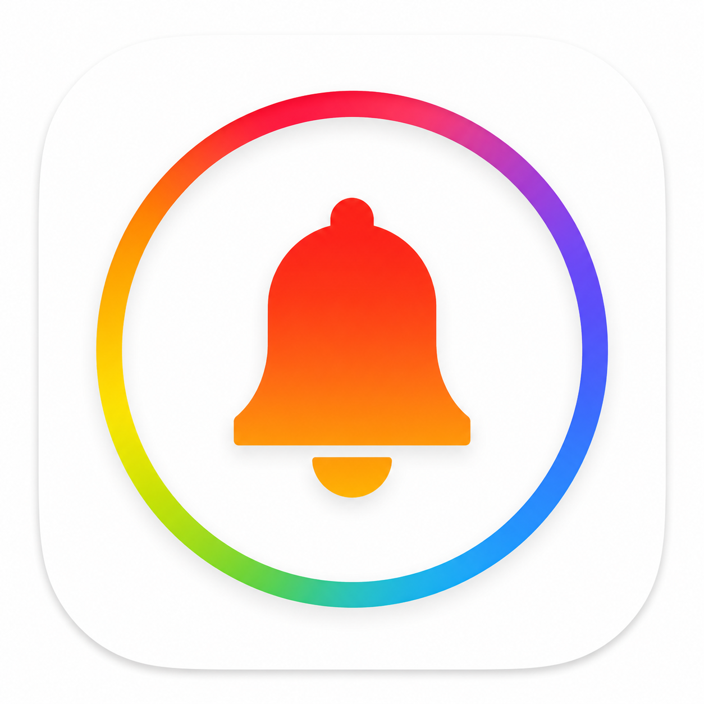

<div align="center">



# Emergency Bell for Everyone

### When you're stuck outside — know who to call and where to go

[한국어](../README.md) · **English** · [中文](README_Chi.md)

<br>

[](https://playmcp.kakaocloud.io)
[](https://playmcp.kakaocloud.io)

> A **KakaoTalk-ready** helper for urgent everyday needs in Korea — powered by **official public data**.  
> For **residents, tourists, people with disabilities, and anyone who feels vulnerable outdoors**.

</div>

---

## What is this?

In Korea, emergencies outside home can be confusing: **119 vs 1339**, **night pharmacies**, **nearest restrooms**, **safety bells on dark streets**.

**Emergency Bell (modu-emergencybell)** connects to KakaoTalk agents. Ask in plain language and get **real locations, phone numbers, and next steps** — not generic web answers.

> **Information only.** We do not place calls, diagnose, or file reports for you.

---

## When to use it

| Situation | Try asking |
|-----------|------------|
| 🚽 **Urgent restroom** | “Wheelchair restroom near Myeongdong Cathedral — urgent!” |
| 💊 **Night / Sunday pharmacy** | “Sunday morning headache — pharmacy near Jongno 3-ga?” |
| 🌡️ **Sick child** | “My kid has 39°C fever at midnight near Mapo — clinic and pharmacy?” |
| 📞 **Which number?** | “Smells like gas in my apartment — who do I call in Korea?” |
| 🌙 **Scared at night** | “Walking alone at Seongsu cafe street — any safety bells nearby?” |
| ♿ **Accessible toilet** | “Where is wheelchair restroom in Yeouido Park?” |
| 🧳 **Subway luggage** | “Can I store my suitcase at Seomyeon Station, Busan?” |
| 📶 **Free WiFi** | “Free WiFi near Hongdae?” |

**Multiple needs at once:**

> “Near Ikseon-dong — mom’s knee is bleeding. ER and pharmacy please.”

---

## How to use it

### On KakaoTalk · PlayMCP

1. Connect the **Emergency Bell** MCP in PlayMCP.
2. Send **one message** with your **place + situation** (English is fine).
3. The agent replies with nearby facilities, hotlines, and what to do next.

**Tips**
- A rough place is enough: “Gangnam Station”, “Myeongdong”, “Itaewon”.
- **Korean addresses** in answers are intentional — show them to taxi drivers or staff.
- The agent can **translate** the reply into your language.

### For developers

| | |
|---|---|
| Endpoint | `https://modu-emergencybell-mcp.playmcp-endpoint.kakaocloud.io/mcp` |
| ID | `modu-emergencybell` |

Technical docs → [DEPLOY_KC.md](DEPLOY_KC.md) · [TOOL_EXAMPLES.md](TOOL_EXAMPLES.md)

---

## Copy & try

```
Wheelchair restroom near Myeongdong Cathedral — urgent!
```

```
Smells like gas — should I call 119 or 1544?
```

```
Where can I store my luggage at Seomyeon Station?
```

```
Free WiFi near Hongdae?
```

More scenarios → [GLOBAL_KAKAOTALK.md](GLOBAL_KAKAOTALK.md) · `python scripts/global_tool_tests.py`

---

## Who is it for?

- 🧑‍🤝‍🧑 **Residents** — restrooms, clinics, pharmacies, ER info  
- 🌏 **Tourists & expats** — ask in **English** (or Chinese)  
- ♿ **Accessibility** — wheelchair restrooms, infant care  
- 🌙 **Night safety** — crime-prevention bells, Safe182 shelters  
- 🎖️ **Veterans** — entrusted hospitals  

---

## Please note

- **Life-threatening emergency → call 119 immediately.**
- Night/holiday clinic & pharmacy hours are **day-level**; call ahead for after-midnight service.
- Guidance is **reference only** — not medical advice or emergency dispatch.

---

## More

| Doc | |
|-----|---|
| [한국어 README](../README.md) | Korean user guide |
| [中文 README](README_Chi.md) | Chinese user guide |
| [GLOBAL_KAKAOTALK.md](GLOBAL_KAKAOTALK.md) | Multilingual tests & details |

---

<div align="center">

**Kakao 2026 AGENTIC PLAYER 10 · Preliminary submission**

Emergency Bell — next steps for **everyone in Korea**

</div>
